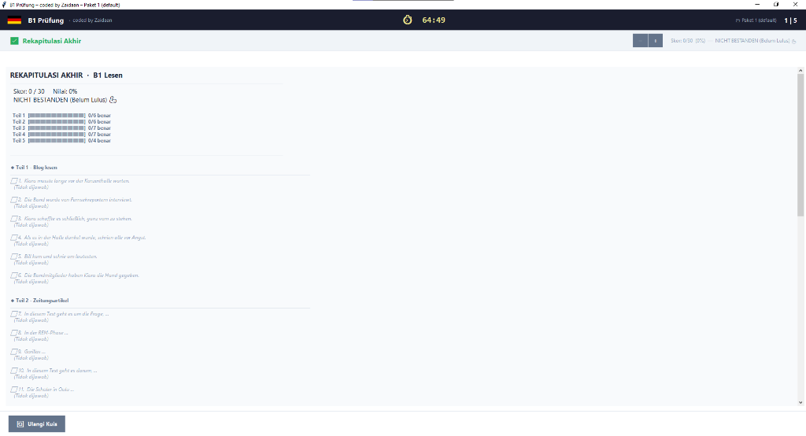

# 🇩🇪 B1 Prüfung Simulation Training

> Aplikasi simulasi ujian **Goethe-Zertifikat B1** untuk Windows, dibuat sebagai alat bantu belajar mandiri.  
> Dikembangkan oleh **Zaidaan**.

> **⚠️ Disclaimer:** Aplikasi ini bukan produk resmi Goethe-Institut dan tidak berafiliasi dengan lembaga tersebut.  
> Soal-soal yang tersedia hanya bersifat latihan dan tidak menjamin kelulusan ujian resmi.

---

## 📥 Cara Mendapatkan Aplikasi

> File `.exe` **tidak disimpan di dalam repository ini.**  
> Unduh versi terbaru melalui halaman **Releases** di bawah ini:

### 👉 [Klik di sini untuk mengunduh → Releases](../../releases/latest)

1. Buka halaman **Releases**
2. Pilih versi terbaru (misal: `v1.0`)
3. Unduh file `B1-Pruefung-Simulation.exe` di bagian **Assets**
4. Jalankan langsung — **tanpa instalasi, tanpa Python**

---

## 📸 Tampilan Aplikasi

|             Tampilan Soal              |            Rekap Akhir            |
| :------------------------------------: | :-------------------------------: |
|  |  |

---

## 📖 Tentang Aplikasi

**B1 Prüfung Simulation Training** adalah aplikasi simulasi ujian bahasa Jerman level B1 berbasis desktop untuk Windows.  
Dirancang untuk memberikan pengalaman latihan yang mendekati kondisi ujian sesungguhnya, lengkap dengan timer resmi dan rekap hasil yang mendetail.

Pada **versi 1.0**, aplikasi berfokus pada bagian **Lesen (Membaca)**.

---

## 🎯 Target Pengguna

- Pelajar dan mahasiswa yang sedang mempersiapkan ujian Goethe-Zertifikat B1
- Peserta kursus bahasa Jerman yang ingin berlatih mandiri
- Siapa saja yang ingin mengukur kemampuan membaca bahasa Jerman level B1

---

## 💻 Kebutuhan Sistem

| Komponen       | Kebutuhan                |
| -------------- | ------------------------ |
| Sistem Operasi | Windows 10 / 11 (64-bit) |
| RAM            | Minimal 256 MB           |
| Penyimpanan    | ± 15 MB (file `.exe`)    |
| Python         | ❌ Tidak diperlukan      |
| Instalasi      | ❌ Tidak diperlukan      |

---

## ✨ Fitur Versi 1.0

### Modul yang Tersedia

| Modul                       | Status          |
| --------------------------- | --------------- |
| 📖 **Lesen** (Membaca)      | ✅ Tersedia     |
| 🎧 **Hören** (Mendengarkan) | 🔜 Segera hadir |
| ✍️ **Schreiben** (Menulis)  | 🔜 Segera hadir |

---

### Daftar Fitur Lengkap

| No  | Fitur                        | Deskripsi                                                                                                  |
| --- | ---------------------------- | ---------------------------------------------------------------------------------------------------------- |
| 1   | **5 Section Lesen**          | Teil 1–5 dengan tipe soal berbeda: Richtig/Falsch, Pilihan Ganda, Zuordnung, Ja/Nein                       |
| 2   | **Timer 65 Menit**           | Countdown otomatis sesuai durasi ujian resmi B1. Indikator berubah merah saat sisa waktu < 5 menit         |
| 3   | **Multi-Paket Soal**         | Muat paket soal tambahan dengan meletakkan file `paket_*.py` di folder yang sama dengan `.exe`             |
| 4   | **Progress Tracking**        | Label "X / Y dijawab" per section dan total progress ditampilkan secara real-time                          |
| 5   | **Navigasi Dot**             | Klik titik navigasi di bagian bawah untuk berpindah langsung ke section tertentu                           |
| 6   | **Zoom Teks**                | Tombol `+` dan `−` untuk memperbesar atau memperkecil ukuran teks bacaan dan soal                          |
| 7   | **Rekap Akhir Lengkap**      | Menampilkan skor, persentase, status lulus/tidak lulus, review tiap soal (✔/✖), penjelasan, dan bukti teks |
| 8   | **Ganti Paket Tanpa Keluar** | Ikon 📦 di header untuk mengganti paket soal tanpa perlu menutup aplikasi                                  |
| 9   | **Restart Kuis**             | Ulangi kuis dengan paket yang sama atau pilih paket soal yang berbeda                                      |

---

## 🗺️ Roadmap

- [x] **v1.0** — Modul Lesen lengkap
- [ ] **v1.x** — Modul Hören (latihan mendengarkan dengan audio player)
- [ ] **v1.x** — Modul Schreiben (latihan menulis surat dan esai terstruktur)
- [ ] **v2.0** — Statistik progres belajar antar sesi

---

## ⚠️ Disclaimer

- Aplikasi ini **bukan produk resmi** Goethe-Institut atau lembaga sertifikasi bahasa Jerman manapun.
- Soal latihan yang tersedia **tidak menjamin** kelulusan ujian B1 resmi.
- Gunakan sebagai **pelengkap** belajar, bukan satu-satunya sumber persiapan.

---

Dibuat dengan ❤️ oleh <strong>Zaidaan</strong>

